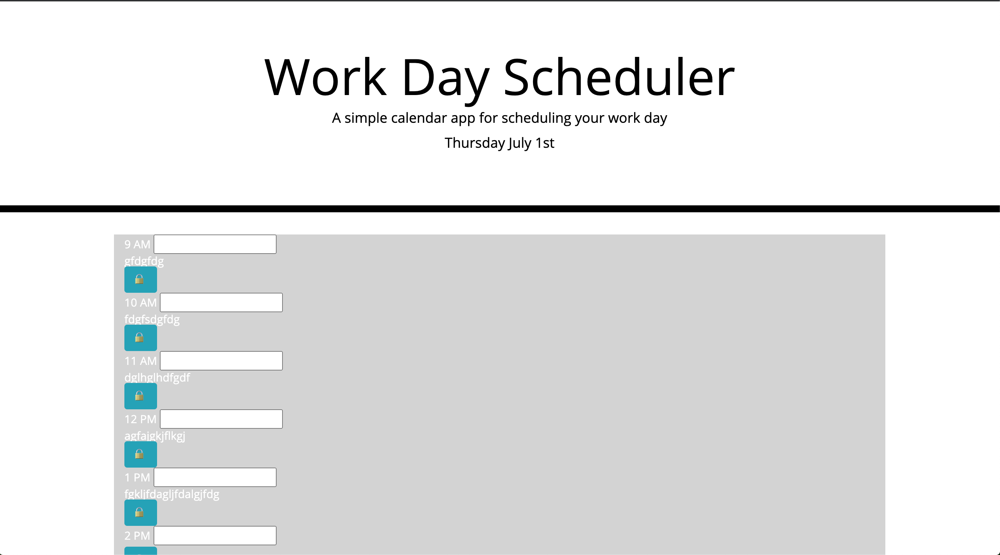

# schedule-planner

In this homework we were supposed to create a work day schedule planner. We had to use many new skills the newest being using the moment feature. We also worked a lot with local storage and figuring out how to format a page through JavaScript. Below are my url's to the repo and also the page itself. I have also attached a screenshot of my page. 

https://kaursim000.github.io/schedule-planner/

https://github.com/kaursim000/schedule-planner

